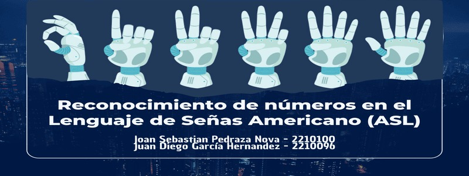

# RECONOCIMIENYO DE NUMEROS EN EL LENGUAJE DE SEÑAS AMERICANO

**Autores: Joan Sebastian Pedraza Nova, Juan Diego García Hernández**

**Objetivo:**Reconocer los dígitos del 0 al 9 en imágenes del lenguaje de señas utilizando sus características relevantes.

**Dataset:**El *American Sign Language Digit Dataset* es un conjunto de datos diseñado para la clasificación de los dígitos del 0 al 9 en lenguaje de señas americano. Este dataset utiliza información de profundidad y puntos clave de la mano generados con el marco de trabajo MediaPipe, lo que mejora la precisión en las tareas de clasificación. Incluye 5000 imágenes en formato RGB (500 por cada dígito) junto con sus respectivas salidas procesadas por MediaPipe, que detecta las manos y extrae 21 puntos clave. El dataset ha sido utilizado para entrenar y evaluar distintos clasificadores, como KNN, SVM, RFC, DTC y redes neuronales, cuyos resultados de precisión están documentados en el código asociado. Este trabajo se basa en investigaciones como "A New 2D Static Hand Gesture Colour Image Dataset for ASL Gestures" de Barczak et al.

**Link del Dataset:** https://www.kaggle.com/datasets/rayeed045/american-sign-language-digit-dataset

**Modelos:** Random Forest, Decision Tree, SVM, Neural Networks, TensorFlow, sklearn.

**Notebook:** https://colab.research.google.com/drive/1wllij0r_v2GmLxS8POTUaPTYO5ptSCtL#scrollTo=qSk8iNGg2ZMu

**Video:** 

**Repositorio:** 
